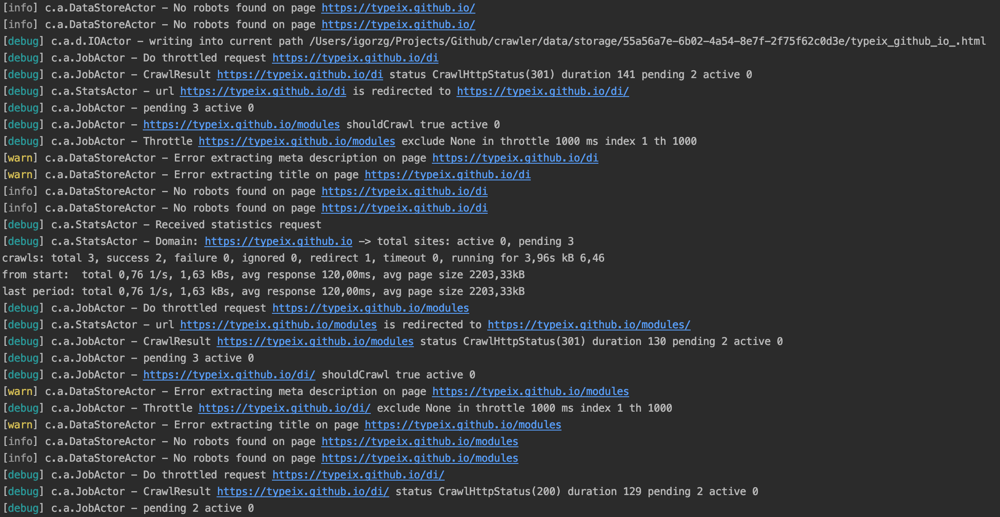

# Web scraping



[Before using this software read article: Is web scraping perfectly legal ?](https://benbernardblog.com/web-scraping-and-crawling-are-perfectly-legal-right)

# Licence: [MIT](LICENSE)

# Requirements

1. [JDK gte 1.8](https://openjdk.java.net/install/)
2. [Sbt gte 1.x.x](https://www.scala-sbt.org/) 
3. [Docker](https://www.docker.com/products/overview)
4. [Terraform](https://www.terraform.io)

## AWS Deployment includes:
* Vpc - Networking - (ipv4, ipv6, public & private subnets)
* Private dns zone
* Mongodb instance
* Elastic search domain
* Lambda cloud formation custom resource
* AWS CodeBuild
* AWS CloudWatch (Events, Logs)
* AWS CloudFormation

[More on AWS](aws)

## Running
* Debugging mode:
```
docker-compose up -d
sbt run -jvm-debug 5005 -J-Xmx4G -Dconfig.resource=application.dev.conf
```
* Prod mode:

You should change prod.conf and set logging to ERROR mode if you running production mode.
```
docker-compose up -d
sbt runProd -J-Xmx4G -Dconfig.resource=application.dev.conf
```

* Docker:
```
docker-compose up -d
sbt docker:publishLocal
docker run -d -p 9000:9000 sphere-api-crawlers:1.0-SNAPSHOT
```

# API

### Schedule job
* HOST: http://localhost:9000
* METHOD: POST
* PATH: /crawler/v2

Multiple jobs:
```json
[
  {
    "url": "https://typeix.github.io",
    "config": {
      "concurrency": 1,
      "throttle": 1000
    }
  },
  {
    "url": "https://en.wikipedia.org",
    "include": [
      "/wiki"
    ],
    "config": {
      "concurrency": 1,
      "throttle": 1000
    }
  },
  {
    "url": "https://en.wikipedia.org",
    "exclude": [
      "/wiki" 
    ],
    "config": {
      "concurrency": 1,
      "throttle": 1000
    }
  }
]
```


### Kill scheduled job
* HOST: http://localhost:9000
* METHOD: DELETE
* PATH: /crawler/v2

Multiple jobs:
```json
[
  {
    "url": "https://typeix.github.io"
  }
]
```

## CONFIG OPTIONS
| Task                  | Type         | Description  |
| --------------------- |:------------:| ------------|
| url                   | String       | link to crawl |
| include               | List[String] | crawl only paths which are in include list |
| exclude               | List[String] | crawl everything except paths in exclude list |

| Config - Key      | Type    | Description  |
| --------------------- |:-------:| ------------|
| throttle              | Integer | crawling delay in ms |
| concurrency           | Integer | number of concurrent ops |
| withIndexThrottle     | Boolean | see index throttle formula |
| withStripOtherQueries | Boolean | in combination with include |

### Throttle formula
* withIndexThrottle - true - default false:
Current pending size * throttle = time of delay
If concurrency is 5 and throttle 1000, sphere will crawl 5 pages at least each second, delay is prolonged based on 
current pending queue, so if current pending queue is 100 sphere will crawl 5 pages each 100 seconds so if page have 
a lot of links and if withIndexThrottle is enabled throttle should not be number bigger than 10.

* withIndexThrottle - false is default behavior:
throttle = time of delay
If concurrency is 5 and throttle 1000, sphere will crawl 5 pages exactly each second.


### After you crawl page
You can find statistics and info in elastic search.
[/crawler/_search](http://localhost:9200/crawler/_search?pretty)

You can find all crawled pages in folder data/storage/.

